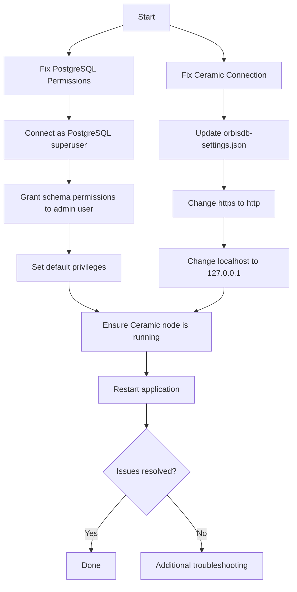

# Comprehensive Solution for PostgreSQL and Ceramic Connection Issues

Based on our investigation, I've identified two separate issues that need to be addressed:

## Issue 1: PostgreSQL Permission Error

The error "permission denied for schema public" indicates that your 'admin' user doesn't have sufficient permissions to create tables in the public schema of the 'ceramic' database.

### Solution for PostgreSQL Issue:

1. **Grant the necessary permissions to the 'admin' user**:

   ```sql
   -- Connect to PostgreSQL as superuser (usually 'postgres')
   psql -U postgres
   
   -- Connect to the ceramic database
   \c ceramic
   
   -- Grant usage on schema
   GRANT USAGE ON SCHEMA public TO admin;
   
   -- Grant create on schema
   GRANT CREATE ON SCHEMA public TO admin;
   
   -- Grant all privileges on all tables
   GRANT ALL PRIVILEGES ON ALL TABLES IN SCHEMA public TO admin;
   
   -- Make privileges apply to future tables
   ALTER DEFAULT PRIVILEGES IN SCHEMA public GRANT ALL ON TABLES TO admin;
   
   -- Make admin the owner of the database (optional but recommended)
   ALTER DATABASE ceramic OWNER TO admin;
   ```

## Issue 2: Ceramic Node Connection Error

The application is trying to connect to `https://localhost:7007/` but your Ceramic node is configured to run on `http://127.0.0.1:7007` (note the protocol and hostname differences).

### Solution for Ceramic Connection Issue:

1. **Update the Ceramic node URL in orbisdb-settings.json**:

   Change this line in orbisdb-settings.json:
   ```json
   "node": "https://localhost:7007/"
   ```
   
   To:
   ```json
   "node": "http://127.0.0.1:7007/"
   ```

   This change addresses two issues:
   - Changes from HTTPS to HTTP (your Ceramic node is using HTTP)
   - Changes from localhost to 127.0.0.1 (for consistency with your Ceramic configuration)

## Implementation Steps:

1. **Fix PostgreSQL permissions** using the SQL commands above

2. **Update the Ceramic node URL** in orbisdb-settings.json:
   ```json
   {
     "configuration": {
       "admins": [
         "did:pkh:eip155:1:0xab16eb371d25001f19da5da238d5e3c01bb198da"
       ],
       "ceramic": {
         "node": "http://127.0.0.1:7007/",
         "seed": "[142,127,169,4,157,165,54,187,122,132,30,238,26,221,181,145,0,196,178,34,159,28,144,137,139,210,3,54,208,212,124,151]"
       },
       "db": {
         "user": "admin",
         "database": "ceramic",
         "password": "admin",
         "host": "127.0.0.1",
         "port": 5432
       }
     },
     "models_mapping": {
       "kh4q0ozorrgaq2mezktnrmdwleo1d": "models_indexed"
     }
   }
   ```

3. **Ensure the Ceramic node is running**:
   - Check if the Ceramic daemon is running with: `ps aux | grep ceramic`
   - If not running, start it with: `cd server/ceramic-mcp && npx @ceramicnetwork/cli daemon`

4. **Restart your application**:
   ```bash
   NODE_ENV=production node index.js
   ```

## Solution Diagram



By addressing both the PostgreSQL permissions and the Ceramic connection issues, your application should be able to create tables and connect to the Ceramic node successfully.